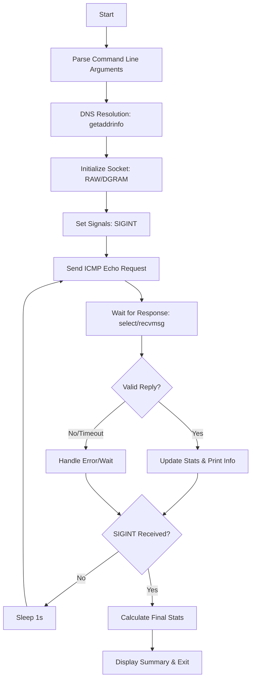

<h1 align="center">
  <a href="https://github.com/jdecorte-be/ft_ping"></a>
  <br>
  ft_ping
</h1>

<p align="center">
    <a href="https://github.com/jdecorte-be/ft_ping"></a>
  <a href="https://github.com/jdecorte-be/ft_ping"></a>
  <a href="https://github.com/jdecorte-be/ft_ping"></a>
  <a href="https://github.com/jdecorte-be/ft_ping"></a>

  
  <a href="https://github.com/jdecorte-be/ft_ping/stargazers">
    
  </a>
  <a href="https://github.com/jdecorte-be/ft_ping/issues">
    
  </a>
  <a href="https://github.com/jdecorte-be/ft_ping">
    
  </a>
  <a href="https://github.com/jdecorte-be/ft_ping">
    
  </a>

</p>

<p align="center">
  <a href="#overview">Overview</a> •
  <a href="#features">Features</a> •
  <a href="#architecture">Architecture</a> •
  <a href="#installation">Installation</a> •
  <a href="#usage">Usage</a> •
  <a href="#troubleshooting">Troubleshooting</a> •
  <a href="#roadmap">Roadmap</a> •
  <a href="#license">License</a>
</p>
<br>

## Overview

**ft_ping** is a high-fidelity re-implementation of the classic ICMP network utility. Developed in C, this project serves as a deep dive into low-level network programming, specifically focusing on the **Internet Control Message Protocol (ICMP)** as defined in **RFC 792**. 

The tool allows users to verify the reachability of a remote host and measure the round-trip time (RTT) for messages sent from the source host to a destination computer. It handles complex tasks such as packet construction, checksum calculation (RFC 1071), signal management, and precise statistical analysis of network latency.

## Key Features

- **ICMP Echo Request/Reply Logic**: Implements the fundamental handshake of the ICMP protocol to determine host availability.
- **Precision RTT Calculation**: Computes minimum, maximum, average, and standard deviation (mdev) of round-trip times using `gettimeofday` and advanced mathematical variance formulas.
- **DNS Resolution**: Dynamically resolves hostnames to IPv4 addresses using `getaddrinfo`, ensuring compatibility with both IP strings and domain names.
- **Dual Socket Support**: Implements a smart fallback mechanism. It attempts to open a `SOCK_RAW` socket (requiring root privileges) and gracefully falls back to `SOCK_DGRAM` if run as a standard user (where supported by the OS).
- **Signal Handling**: Integrated `SIGINT` (Ctrl+C) interception to gracefully terminate the process and display a comprehensive statistical summary.
- **Robust Checksumming**: Manual implementation of the 16-bit one's complement sum algorithm required for ICMP header integrity.

## Architecture

### Logic Flow

1.  **Initialization**: Parse CLI arguments using `argp`. 
2.  **Resolution**: Convert the target hostname into a `sockaddr_in` structure.
3.  **Privilege Management**: Initialize the ICMP socket. If root, use `SOCK_RAW`. If not, attempt `SOCK_DGRAM`. Drop privileges immediately after socket creation for security.
4.  **Transmission Loop**: 
    -   Construct an ICMP header.
    -   Calculate the checksum.
    -   Transmit the packet and record the timestamp.
5.  **Reception Logic**: 
    -   Monitor the socket for incoming data using `select` with a timeout.
    -   Parse the received IP/ICMP header.
    -   Validate the process ID and sequence number.
    -   Calculate the elapsed RTT.
6.  **Termination**: Calculate final variance and standard deviation of the session and exit.

### System Flow Diagram



## Prerequisites

To build and run **ft_ping**, you need the following environment:
- **OS**: Linux (Debian/Ubuntu recommended)
- **Compiler**: GCC (support for C99 or later)
- **Libraries**: `libc6-dev`
- **Permissions**: Root privileges are required for `SOCK_RAW` usage, or `cap_net_raw` capabilities must be set on the executable.

## Installation

### 1. Clone the Repository
```bash
git clone https://github.com/yourusername/ft_ping.git
cd ft_ping
```

### 2. Build the Executable
Use the provided `Makefile` to compile the source code.
```bash
make
```
*Expected output:*
```text
Compiling: srcs/main.c
Compiling: srcs/ping.c
Linking: ft_ping
Build complete!
```

### 3. Docker Environment (Optional)
If you wish to test in a clean environment, use the provided `Dockerfile`:
```bash
docker-compose up --build
```

## Usage Guide

### Basic Command
```bash
sudo ./ft_ping google.com
```

### Verbose Mode
To see detailed packet information (including ID and sequence tracking):
```bash
./ft_ping -v 8.8.8.8
```

### Key Function Parameters

-   `int send_echo_icmp(t_ping *ping)`: Constructs the ICMP header. It sets `icmp->type = ICMP_ECHO` and maps the `ping->pid` to the `icmp->un.echo.id` to identify returned packets.
-   `int recv_echo_icmp(t_ping *ping)`: Utilizes `recvmsg` and `CMSG_DATA` to extract the **TTL** (Time To Live) from the packet's ancillary data when using raw sockets.
-   `int checksum(uint16_t *buf, int len)`: Performs a 16-bit sum of the header, handles odd-byte lengths, and returns the one's complement.

## Troubleshooting

| Issue | Cause | Resolution |
| :--- | :--- | :--- |
| `Lacking privilege for icmp socket` | Missing root or capabilities | Run with `sudo` or use `setcap cap_net_raw+ep ft_ping` |
| `unknown host` | DNS failure or No Network | Verify `/etc/resolv.conf` and active internet connection |
| `checksum mismatch` | Corrupted packet or logic error | Ensure the data buffer is zeroed before checksum calculation |
| `packet too short` | Malformed ICMP response | Check network MTU or if a firewall is stripping headers |

## Roadmap

- [ ] **IPv6 Support**: Integration of `ICMP6` and `AF_INET6` for modern network compatibility.
- [ ] **Custom Payload**: Allow users to specify the number of bytes in the data segment.
- [ ] **Adaptive Interval**: Implement a `-i` flag to change the transmission frequency from the default 1 second.
- [ ] **Flood Mode**: Add a high-frequency `-f` mode for stress testing (superuser only).

## License
This project is licensed under the MIT License - see the `LICENSE` file for details.
